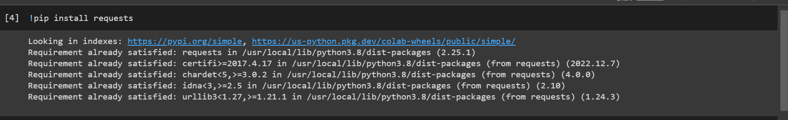
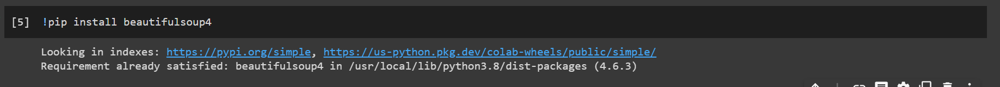
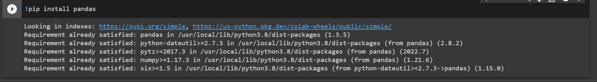
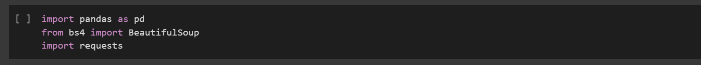

- PRAKTIKUM 11

# Web Scraping Menggunakan Python

- untuk melakukan scrapping web kita memerlukan beberapa library dalam python diantaranya adalah request pandas beautifulsoup bs4

# Instal Library request

- ketika kita ingin menginstal nya cukup menggunakan perintah seperti di bawah ini

pip install request

# Instal Library bs4

- Ketika kita ingin menginstal nya cukup menggunakan perintah seperti di bawah ini

# Instal Library BeautifulSoup4

- ketika kita ingin menginstal nya cukup menggunakan perintah seperti di bawah ini

pip install BeautifulSoup4

# Instal Library Pandas

- ketika kita ingin menginstal nya cukup menggunakan perintah seperti dibawah ini

- sebelum menjalankan program utama kita harus menggunakan perintah seperti di bawah ini

# HASIL

